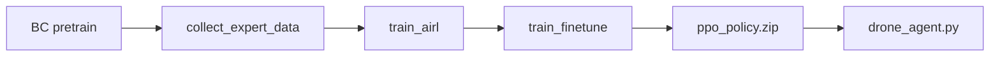

# Swarm Drone RL Training Framework

Production-oriented PPO training (optional AIRL / BC) for `MovingDroneAviary`, aligned with validator scoring and `swarm/submission_template/drone_agent.py`.

## Architecture overview

```
RL/
├── framework/                 # Reusable library (configs, rewards, curriculum, training)
│   ├── config/                # YAML → dataclasses
│   ├── rewards/               # Modular shaping + Gym wrapper
│   ├── curriculum/            # Stage-based task difficulty
│   ├── env/                   # VecEnv + VecNormalize factory
│   ├── policies/              # MLP / MultiInput / custom CNN / optional LSTM
│   ├── callbacks/             # TB, W&B, eval, curriculum
│   ├── evaluation/            # Metrics + rollouts
│   ├── training/              # PPO, BC, AIRL loops
│   ├── optimization/          # Optuna study
│   └── checkpoints/           # Export to submission_template
├── train_scripts/             # CLI entry points + YAML configs
│   ├── train_pretrain.py
│   ├── train_finetune.py
│   ├── train_airl.py
│   ├── optimize_hyperparams.py
│   ├── evaluate.py
│   └── collect_expert_data.py
├── customnetwork.py           # CNN+state feature extractor (existing)
├── swarm_airl.py              # Dict-obs AIRL (existing)
└── dict_observation_replay_buffer.py
```

### Design choices (why)

| Choice | Rationale |
|--------|-----------|
| **Incremental `flight_reward`** in env | `MovingDroneAviary` already exposes validator-aligned dense reward; PPO learns without custom wrappers by default. |
| **`ModularRewardWrapper`** | Extra shaping (hover, smooth actions, proximity) is opt-in via YAML weights for research ablations. |
| **`VecNormalize`** | Stabilizes depth + state scales across random maps; disabled in fine-tune config when resuming (matches your `ppo_train.py` practice). |
| **`custom` policy** | Depth (128×128) + 115-d state needs CNN+MLP; reuses battle-tested `RL/customnetwork.py`. |
| **Curriculum via `task_for_seed_and_type`** | Uses real `task_gen` challenge types instead of fake difficulty flags. |
| **BC → PPO → AIRL → fine-tune** | BC gives a sane initialization; AIRL matches expert style; fine-tune optimizes validator score with gentler PPO updates. |
| **Optuna composite objective** | Validator cares about success, safety, and smooth flight—not raw return alone. |
| **Export to `submission_template/ppo_policy.zip`** | Matches `DroneFlightController` which loads `PPO.load(.../ppo_policy)`. |

## Validator score (maximize this)

From `drone_agent.py` and `flight_reward`:

```text
score = 0.45 × success + 0.45 × time + 0.10 × safety
```

Training tips:

- **Success (45%)**: curriculum from easy types (1–2) to village/moving platform (3–6).
- **Time (45%)**: encourage progress + speed terms in env reward; avoid excessive hover shaping late in training.
- **Safety (10%)**: penalize low clearance and collisions; `min_clearance` is logged in env `info`.

The trained policy is copied automatically to:

`swarm/submission_template/ppo_policy.zip`

Ensure `drone_agent.py` uses:

```python
class DroneFlightController:
    def __init__(self):
        model_path = Path(__file__).parent / "ppo_policy.zip"
        self.model = PPO.load(model_path.with_suffix(""))
```

## Troubleshooting: “TensorBoard then nothing”

### If you see `Serving TensorBoard on localhost:6006` right after the SWARM banner

**Root cause (fixed):** A file named `tensorboard.py` in the **repo root** shadowed the real TensorBoard package. Any `import tensorboard` during training ran that script, started the TB server, and **blocked forever**. Use `RL/train_scripts/launch_tensorboard.py` in a separate terminal instead.

If it still happens, that message is from the **TensorBoard web server** (`tensorboard` CLI), not from training itself.

Correct training output **starts with**:

```text
============================================================
SWARM train_pretrain.py
Python: D:\...\miniconda3\envs\swarm\python.exe
============================================================
```

**Fix:**

1. Stop the TensorBoard process (`Ctrl+C` in that terminal).
2. Run training in a **separate** terminal (do not run `tensorboard` in the same command):
   ```bash
   cd C:\Users\Gru\Documents\proj\swarm
   python -u RL/train_scripts/train_pretrain.py --config RL/train_scripts/configs/pretrain_default.yaml
   ```
3. Or on Windows: `powershell -File RL/train_scripts/run_pretrain.ps1`
4. Verify the right file runs:
   ```bash
   python RL/train_scripts/verify_train_cli.py
   ```

View logs **after** training writes them (optional, second terminal):

```bash
# PPO / SB3 (event files directly under log dir)
tensorboard --logdir RL/train_scripts/logs/pretrain/

# AIRL (imitation writes under <tensorboard_dir>/summary/)
tensorboard --logdir RL/train_scripts/logs/medium/airl/summary
# or from repo root:
python RL/train_scripts/launch_tensorboard.py --logdir RL/train_scripts/logs/medium/airl
```

### Monitoring AIRL in TensorBoard

AIRL (`init_tensorboard=True`) stores **PyTorch SummaryWriter** files in:

```text
RL/train_scripts/logs/<level>/airl/summary/events.out.tfevents.*
```

Not in the parent `airl/` folder itself. If TensorBoard is empty:

1. Run TensorBoard from **repo root** (not `RL/train_scripts/`).
2. Point at `.../airl/summary` or use `launch_tensorboard.py` (it auto-detects `summary/`).
3. Do **not** use `Path(train_scripts) / RL/train_scripts/logs/...` — that was a common wrong path.

**What appears in TB for AIRL today:** mostly `disc_logits` histogram (every 20 discriminator steps). Discriminator scalars (`loss`, `acc`, etc.) go to the **terminal** via imitation's logger, not always to TensorBoard. Generator (PPO) metrics during AIRL are printed in the training console unless you add `tensorboard_log` to the learner separately.

**While AIRL runs:** watch the terminal for `AIRL round X/Y` and discriminator stats after each `train_disc` dump.

### Fine-tune crash: `NaN` in policy at curriculum eval

Usually **PPO diverged** (~1.5M+ steps) with `vf_coef` too high for the custom CNN (use **0.15**, not 0.5–1.0). Eval callbacks now **skip** instead of crashing.

**Recover:**

```bash
# Use last good checkpoint (before NaN), not the crashed run
python -u RL/train_scripts/train_finetune.py \
  --config RL/train_scripts/configs/finetune_medium.yaml \
  --resume RL/train_scripts/checkpoints/finetune/ppo_swarm_1000000_steps.zip
```

Also pass `--config` matching your level; default `finetune_default.yaml` uses different paths than `checkpoints/airl/policy/`.

The PyBullet env expects actions with shape `(1, 5)` (one drone), not `(5,)`. This is fixed in `evaluator.py` (same as `RL/play.py` using `env.step(act[None, :])`). Re-run training; it will resume from checkpoints if you pass `--resume`.

### If you see the SWARM banner but then silence

1. **BC phase** — collects random PyBullet episodes (`BC collection: episode X/Y`).
2. **First PPO rollout** — `n_steps × n_envs` steps before the first SB3 log line.
3. **Windows** — keep `vec_env.subproc: false`.
4. **`--skip-bc`** — needs `bc_pretrain.zip` or `--resume path/to/model.zip`.

```bash
python RL/train_scripts/train_pretrain.py --skip-bc --resume RL/train_scripts/checkpoints/pretrain/bc_pretrain.zip
```

## Setup

```bash
pip install -r requirements.txt
pip install -r RL/train_scripts/requirements-rl-extra.txt
```

Optional: `wandb login` if `logging.wandb_enabled: true`.

## Quick start pipeline

From repository root:

```bash
# 1) BC + PPO pretrain (easy → medium curriculum)
python RL/train_scripts/train_pretrain.py --config RL/train_scripts/configs/pretrain_default.yaml

# 2) Optional: collect demos & AIRL
python RL/train_scripts/collect_expert_data.py --policy RL/train_scripts/checkpoints/pretrain/ppo_policy.zip
python RL/train_scripts/train_airl.py --config RL/train_scripts/configs/airl_default.yaml

# 3) Fine-tune on hard maps (resume best checkpoint)
python RL/train_scripts/train_finetune.py --resume RL/train_scripts/checkpoints/airl/policy/ppo_policy_35.zip

# 4) Evaluate
python RL/train_scripts/evaluate.py --model swarm/submission_template/ppo_policy.zip --n-episodes 50
```

## Level configs (simple / medium / hard / real hard)

Original defaults (`*_default.yaml`) are unchanged. Per-level configs aligned with `RL/learning.md` live in `RL/train_scripts/configs/` — see `configs/README.md`.

| Level | Pretrain | AIRL | Fine-tune | Pretrain steps | Fine-tune steps |
|-------|----------|------|-----------|----------------|-----------------|
| Simple | `pretrain_simple.yaml` | `airl_simple.yaml` | `finetune_simple.yaml` | 300k | 300k |
| Medium | `pretrain_medium.yaml` | `airl_medium.yaml` | `finetune_medium.yaml` | 800k | 1.5M |
| Hard | `pretrain_hard.yaml` | `airl_hard.yaml` | `finetune_hard.yaml` | 1.5M | 5M |
| Real hard | `pretrain_real_hard.yaml` | `airl_real_hard.yaml` | `finetune_real_hard.yaml` | 2M | 15M |

Example (medium):

```bash
python -u RL/train_scripts/train_pretrain.py --config RL/train_scripts/configs/pretrain_medium.yaml
python -u RL/train_scripts/collect_expert_data.py --config RL/train_scripts/configs/airl_medium.yaml
python -u RL/train_scripts/train_airl.py --config RL/train_scripts/configs/airl_medium.yaml
python -u RL/train_scripts/train_finetune.py --config RL/train_scripts/configs/finetune_medium.yaml \
  --resume RL/train_scripts/checkpoints/medium/airl/policy/ppo_policy_35.zip
```

Level configs use **validator `flight_reward` only** (extra shaping weights = 0), `vf_coef: 0.15` during pretrain (custom CNN), and **`norm_obs/norm_reward: false`** during fine-tune (matches legacy `ppo_train.py --no-norm-obs`).

## Scripts reference

### `train_pretrain.py`

1. **BC phase**: random-action rollouts → NLL on policy (warm start).
2. **PPO phase**: vectorized envs, curriculum, optional reward wrapper, checkpoints + submission export.

Flags: `--skip-bc`, `--skip-ppo`, `--bc-output PATH`.

### `train_finetune.py`

Loads `resume_path`, applies lower LR / clip (YAML `lr_end`, `clip_range`), typically **disables VecNormalize** to avoid distribution shift when continuing from BC/AIRL.

### `train_airl.py`

Uses `SwarmAIRL` + `CustomShapedRewardNet`. Requires expert `.pkl` or BC policy to sample demos.

### `collect_expert_data.py`

Rolls out a checkpoint with `imitation.rollout` → **pickle** (`.pkl`) for AIRL. Do not use `imitation.data.serialize.save` — it does not support Dict observations.

### `optimize_hyperparams.py`

Optuna TPE search over LR, γ, GAE, clip, entropy, batch, epochs, network width. Objective:

```text
0.35×success − 0.25×collision + 0.15×smoothness + 0.15×norm_reward + 0.10×path_efficiency
```

Best params → `checkpoints/hpo/best_params.json`.

### `evaluate.py`

Reports success/collision/reward/length/path efficiency/smoothness/energy/validator score.

## YAML configuration

| File | Purpose |
|------|---------|
| `configs/pretrain_default.yaml` | BC + PPO, curriculum stages 1→3→4 |
| `configs/finetune_default.yaml` | Long run, resume, W&B, no norm |
| `configs/airl_default.yaml` | AIRL rounds / discriminator |
| `configs/pretrain_{simple,medium,hard,real_hard}.yaml` | Level-specific BC + PPO |
| `configs/airl_{simple,medium,hard,real_hard}.yaml` | Level-specific AIRL |
| `configs/finetune_{simple,medium,hard,real_hard}.yaml` | Level-specific fine-tune |
| `configs/rewards_shaping.yaml` | Modular reward weights only |
| `configs/optuna_default.yaml` | HPO trial budget |
| `configs/README.md` | Level config index and commands |

Key sections: `reward`, `curriculum`, `ppo`, `policy`, `vec_env`, `logging`, `checkpoint`, `evaluation`, `bc`, `airl`, `optuna`.

### Reward weights (`configs/rewards_shaping.yaml`)

| Component | Typical weight | Role |
|-----------|----------------|------|
| `goal_progress` | +1.0 | Dense progress to goal |
| `collision` | −5.0 | Hard failure signal |
| `obstacle_proximity` | −0.5 | Clearance before impact |
| `hover_stability` | +0.3 | Low speed near goal |
| `smooth_action` | −0.05 | Reduces jerk |
| `angular_velocity` | −0.02 | Limits aggressive yaw |
| `alive` | +0.01 | Survival bonus |
| `energy` | −0.02 | Action magnitude penalty |

Set `use_env_reward: true` (default) to keep validator `flight_reward` increment; shaping adds on top.

### PPO defaults (robotics)

```yaml
learning_rate: 3e-4
gamma: 0.995
gae_lambda: 0.95
clip_range: 0.2
ent_coef: 0.005
vf_coef: 0.5
n_steps: 4096
batch_size: 512
n_epochs: 10
```

Fine-tune: lower `clip_range` (0.08–0.12), `lr_end`, fewer epochs, `ent_coef` 0.003–0.005.

### Policy types (`policy.policy_type`)

- `custom` — **recommended** — `RL/customnetwork.py` CNN on depth + velocity from state.
- `multiinput` — SB3 default MultiInputPolicy.
- `mlp` — state-only (not suitable for depth tasks).
- `recurrent` — `sb3-contrib` LSTM (partial observability experiments).

## Curriculum learning

Stages in YAML define:

- `challenge_types` — passed to `task_for_seed_and_type` (same distribution as validator).
- `min_success_rate` / `min_episodes` — auto-advance when eval success is high enough.
- `moving_platform_prob` — moving landing pad difficulty.

`CurriculumCallback` runs eval every `evaluation.eval_freq` steps and bumps the stage index.

## Hyperparameter tuning guide

| Parameter | Increase when… | Decrease when… |
|-----------|----------------|----------------|
| `learning_rate` | Slow learning, stable returns | Policy collapse, oscillating KL |
| `gamma` | Long-horizon credit needed | Unstable value targets |
| `gae_lambda` | High variance advantages | Bias in advantage estimates |
| `clip_range` | Too conservative updates | Large policy jumps / crashes |
| `ent_coef` | Premature convergence | Too much random flight |
| `n_steps` | Sparse rewards | Slow iteration / OOM |
| `batch_size` | Noisy gradients | GPU RAM limits |
| `n_epochs` | Underfitting each rollout | Overfitting on-policy data |

Run HPO before long fine-tunes:

```bash
python RL/train_scripts/optimize_hyperparams.py --n-trials 30
```

## Common PPO failure modes (drones)

1. **Value explosion** — enable `VecNormalize`, lower `vf_coef` for custom net (~0.15–0.5), use `clip_range_vf`.
2. **Policy forgets after resume** — disable obs/reward norm when fine-tuning from BC/AIRL checkpoint.
3. **Collision spiral** — raise collision penalty weight or curriculum slower; increase `ent_coef` briefly.
4. **Hovering at start** — reduce `hover_stability` weight; ensure progress reward dominates.
5. **Jerky actions** — increase `smooth_action` / `angular_velocity` penalties; lower `log_std_init` (e.g. −1.8).
6. **PyBullet OOM with many envs** — use `n_envs: 4–8`, `SubprocVecEnv`; GUI only with `n_envs: 1`.

## Reward shaping pitfalls

- **Double counting**: `use_env_reward: true` + large manual progress terms can over-reward zig-zag paths.
- **Terminal clash**: env already returns near-zero on collision terminal; huge collision penalty can dwarf learning signal.
- **Norm reward + shaping**: normalized env return can dwarf small shaping terms—tune `env_reward_scale`.
- **Misaligned objective**: maximizing only shaped reward may hurt validator **time** component—always eval with `evaluate.py`.

## Stabilization tricks

1. Linear LR schedule (`ppo.lr_end`) during fine-tune.
2. Start with BC on random demos (explores action space legally).
3. AIRL with conservative `gen_lr` / `disc_lr` (5e-5) after BC.
4. Deterministic eval (`evaluate.py`) for checkpoint selection; stochastic train for exploration.
5. Seed control: `seed` in YAML + per-env offset `rank * 7919`.
6. Checkpoint every 250k–500k steps; keep best eval model for submission.

## Logging

- **TensorBoard**: `logging.tensorboard_dir` → `tensorboard --logdir RL/train_scripts/logs/`
- **W&B**: set `logging.wandb_enabled: true` and project/entity in YAML.

Logged metrics: episode return/length, eval success/collision, curriculum stage, AIRL discriminator loss (AIRL script).

## Checkpoint & resume

- PPO checkpoints: `checkpoint.dir/ppo_swarm_*_steps.zip`
- VecNormalize stats: `checkpoint.dir/vecnormalize.pkl` (auto-saved after train)
- Resume: set `resume_path` in YAML or `--resume` on fine-tune script

## AIRL workflow detail



Discriminator uses `CustomShapedRewardNet` (shared CNN features). Generator is PPO loaded from BC.

## File map to existing code

| Framework module | Reuses |
|------------------|--------|
| `env/factory.py` | `swarm.utils.env_factory.make_env`, `task_gen` |
| `rewards/wrapper.py` | env `info` keys from `MovingDroneAviary._computeInfo` |
| `training/airl.py` | `RL/swarm_airl.py`, `RL/customnetwork.py` |
| `training/bc.py` | pattern from `RL/pretrain_ppo.py` |
| `policies/builder.py` | `RL/customnetwork.feature_extractor` |

## Extending the framework

1. Add reward component in `framework/rewards/components.py` + weight in `RewardWeights`.
2. Add curriculum stage in YAML `curriculum.stages`.
3. Add callback in `framework/callbacks/` and register in `training/trainer.py`.
4. New policy: extend `policies/builder.py` `resolve_policy_class`.

## Recommended training schedule (subnet 124)

| Phase | Timesteps (order of magnitude) | Config |
|-------|-------------------------------|--------|
| BC + pretrain PPO | 0.5M–1M | `pretrain_default.yaml` |
| AIRL | 35 rounds × 12k steps | `airl_default.yaml` |
| Fine-tune | 3M–15M | `finetune_default.yaml` |
| HPO (optional) | 150k per trial | `optuna_default.yaml` |

Select the checkpoint with highest **eval success** and acceptable **collision rate**, then confirm `mean_validator_score` in `evaluate.py` before submitting `ppo_policy.zip`.

---

For legacy one-file training, `RL/ppo_train.py` and `RL/airl_train.py` remain available; new work should prefer `RL/train_scripts/` for YAML-driven reproducibility.
